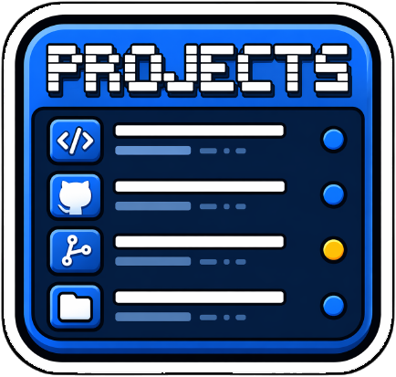

# Macos_GithubProjects



[🇬🇧 EN](README_en.md) · [🇫🇷 FR](README.md)

✨ Hub central pour gérer tous mes projets GitHub locaux : menu bar app macOS, dashboard HTML interactif, et vues de comparaison local ↔ GitHub.

## Fonctionnalités

- **Menu Bar App** : Accès rapide à tous les projets depuis la barre de menu macOS, avec icône par projet et compteur en temps réel.
- **Dashboard HTML** : Interface web avec recherche instantanée, filtres par groupe et par statut Git.
- **Hub portfolio** (`hub.html`) : Page centralisant tous mes projets, sites et extensions.
- **Comparaison local ↔ GitHub** (`comparison.html`) : Analyse croisée projets locaux ↔ dépôts GitHub avec **matching par remote** (gère renommages/typos/casse), dépôts **privés** inclus (via `gh`) et dépôts **archivés** filtrés.
- **Profil GitHub** (`github-profile.html`) : Page de profil générée automatiquement.
- **Liste Markdown** (`projects.md`) : Documentation des projets avec avertissements (no desc, no icon, no git, dirty…).
- **Icônes personnalisées** : Affichage des `icon.png` de chaque projet.
- **Statut Git** : Indicateurs visuels (Clean, Dirty, No Remote, No Git).
- **Parité GitHub** : Script `check_github_parity.py` vérifiant la cohérence local ↔ GitHub via les remotes.

## Menu Bar App

Application `rumps` accessible depuis la barre de menu. Le titre affiche le nombre de projets (ex. `📁 106`).

### Lancement

Double-cliquez sur `launch_app.command` ou :

```bash
./.venv/bin/python3 src/app/menu_app.py &
```

### Menu

- **Update Dashboard** : Relance le scan et régénère tous les outputs.
- **Open Dashboard** : Ouvre le dashboard HTML dans le navigateur.
- **Open Hub** : Ouvre le hub portfolio.
- **Open Comparaison** : Ouvre la vue local ↔ GitHub.
- **Open GitHub Profile** : Ouvre le profil GitHub généré.
- **Quick Actions** : 🏠 Local · 🌐 GitHub · 🗂️ Finder
- **Liste des projets** : Clic → ouverture dans VS Code (icône du projet à gauche, logo GitHub si dépôt Git).
- **Quit** : Ferme l'application.

## Dashboard & vues générées

Le scanner (`src/app/scanner.py`) analyse `PROJECTS/` et génère 5 fichiers dans `generated/` :

| Fichier | Rôle |
|---|---|
| `dashboard-projets.html` | Dashboard interactif (recherche, filtres groupe/statut Git) |
| `hub.html` | Hub portfolio central |
| `comparison.html` | Comparaison projets locaux ↔ dépôts GitHub |
| `github-profile.html` | Profil GitHub auto-généré |
| `projects.md` | Liste Markdown avec avertissements |

## Parité local ↔ GitHub

La comparaison et le script de parité reposent sur les **remotes git** (source de vérité), jamais sur les noms de dossiers :

```bash
# Vue HTML interactive (local ↔ GitHub)
open generated/comparison.html

# Check CLI rapide
./.venv/bin/python3 src/macos_githubprojects/check_github_parity.py --user mondary
```

**Matching** (par ordre de fiabilité) :
1. Remote `origin` du projet local → repo GitHub (résout renommages & typos)
2. Alias explicites (fallback)
3. Nom insensible à la casse (fallback)

**Fetch GitHub** : authentifié via `gh auth token` si disponible → inclut les **dépôts privés** (badge *privé*) et augmente le rate limit. Sinon fallback anonyme (publics seulement). Les **dépôts archivés** sont automatiquement filtrés.

Affiche : projets locaux sans remote (à pousser) et dépôts GitHub sans dossier local (à cloner/archiver).

## Convention de nommage

Tous les projets suivent `<Plateforme>_PK<Nom>[--fork]` :

- **Plateforme** *(obligatoire)* : `Chrome_` `Macos_` `Web_` `CLI_` `WP_` `VS_` `RC_` `Android_`…
- **PK** *(toujours présent)* : marqueur de mes produits (trouvabilité stores)
- **Nom** : PascalCase, descriptif
- **--fork** : uniquement pour un fork suivi en parallèle de l'upstream

Exemples : `Macos_PKpowerlines`, `Web_PKcuisto`, `Chrome_PKScriptcat`.

## Structure

```
Macos_GithubProjects/
├── src/
│   ├── app/
│   │   ├── scanner.py          # Entry point : régénère tous les outputs
│   │   ├── menu_app.py         # Wrapper menu bar app
│   │   └── cli.py              # Wrapper CLI
│   └── macos_githubprojects/
│       ├── update_projects_dashboard.py  # Moteur de scan + génération
│       ├── menu_app.py                     # Logique menu bar app
│       └── check_github_parity.py          # Parité local ↔ GitHub
├── generated/
│   ├── dashboard-projets.html
│   ├── hub.html
│   ├── comparison.html
│   ├── github-profile.html
│   ├── projects.md
│   └── assets/
├── icon.png
├── launch_app.command          # Launcher double-clic
└── README.md
```

## Développement

### Environnement virtuel

```bash
python3 -m venv .venv
source .venv/bin/activate
pip install -r requirements.txt
```

### Commandes

```bash
# Régénérer le dashboard + toutes les vues
./.venv/bin/python3 src/app/scanner.py

# Lancer le menu bar app
./.venv/bin/python3 src/app/menu_app.py &

# Vérifier la parité local ↔ GitHub
./.venv/bin/python3 src/macos_githubprojects/check_github_parity.py --user mondary
```

## Statut Git

Les projets affichent un indicateur selon leur état Git :

- 🟢 **Clean** : Dépôt Git propre avec remote
- 🟡 **Dirty** : Modifications non commitées
- 🟡 **No Remote** : Pas de remote configuré
- 🔴 **No Git** : Pas un dépôt Git

## 🧾 Changelog

- **2.1.0** : Matching comparaison par remote (renommages/typos), fetch GitHub authentifié (dépôts privés), filtrage des archivés, convention de nommage `<Plateforme>_PK<Nom>`, badges *privé*/*aka*.
- **2.0.0** : Hub portfolio, comparaison local/GitHub, profil GitHub, parité GitHub, structure `src/app/` + `src/macos_githubprojects/`.
- 1.0.0 : Version initiale (menu bar app + dashboard).

## 🔗 Liens

- README EN : [README_en.md](README_en.md)
