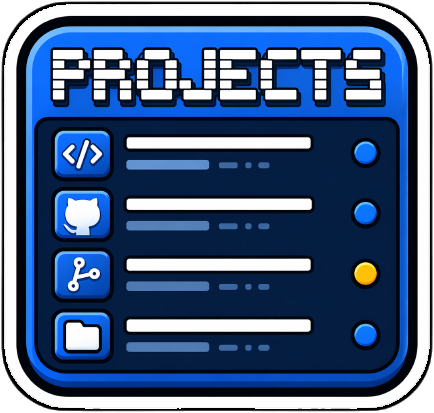

# Macos_GithubProjects

[🇬🇧 EN](README_en.md) · [🇫🇷 FR](README.md)

✨ Central hub for automation tools and specialized skills for AI agents.

## ✅ Features

- **AI Agent Skills** : Library of specialized skills in `.agent/-skills` (Design, Git, Publishing, Writing).
- **Automation Tools** : Python scripts in `tools/` for dashboard updates, auto-tagging, and project organization.
- **Publishing Workflows** : Automated procedures for VS Code Marketplace, Chrome Web Store, MacOS (Sparkle), and WordPress.
- **Infrastructure** : Domain redirection automation (OVH).

## 🧠 Usage

### Tools (`tools/`)
Run the Python scripts as needed:
- `projects_hub.py`: Project hub management.
- `update_projects_dashboard.py`: Dashboard updates.

### Skills (`.agent/-skills/`)
These Markdown files are designed to be injected into an AI agent's context to provide precise instructions for complex tasks.

## 🧾 Changelog

- 1.0.0: Initial release.

## 🔗 Links

- FR README: [README.md](README.md)
