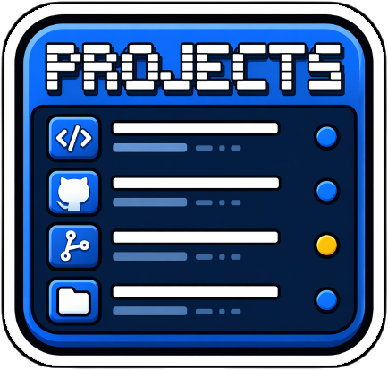

# Macos_GithubProjects



[🇬🇧 EN](README_en.md) · [🇫🇷 FR](README.md)

✨ Central hub for automation tools and specialized skills for AI agents.

## ✅ Features

- **AI Agent Skills** : Library of specialized skills in `.agent/-skills` (Design, Git, Publishing, Writing).
- **Automation Tools** : The operational project lives in `src/`: code, CLI wrappers, install script, and generated files.
- **Publishing Workflows** : Automated procedures for VS Code Marketplace, Chrome Web Store, MacOS (Sparkle), and WordPress.
- **Infrastructure** : Domain redirection automation (OVH).

## 🧠 Usage

### Tools
Application code lives in `src/macos_githubprojects/`. The `src/tools/*.py` scripts are CLI entrypoints:
- `src/script_hub.py`: Interactive menu to launch scripts.
- `projects_hub.py`: Project hub management.
- `update_projects_dashboard.py`: Dashboard updates.

```bash
# Main interactive menu
./.venv/bin/python3 src/script_hub.py

# Generate the HTML dashboard and Markdown
./.venv/bin/python3 src/tools/projects_hub.py dashboard

# Launch the macOS menu bar app
./.venv/bin/python3 src/tools/menu_app.py
```

Generated files:
- `generated/dashboard-projets.html` (dashboard + GitHub profile README)
- `generated/projects-library.html` (local catalog, inspi·library style)
- `generated/projects.md`

Automation:
- Menu bar LaunchAgent `com.user.macosgithubprojects` (manual "Update Dashboard")
- Daily LaunchAgent `com.user.pkprojects-sync` (9:00 + at login) runs `src/macos_githubprojects/sync_projects.py`: regenerates every view and auto-pushes `mondary/README.md` when it changed. Logs: `~/Library/Logs/pkprojects-sync.log`.

### Skills (`.agent/-skills/`)
These Markdown files are designed to be injected into an AI agent's context to provide precise instructions for complex tasks.

## 🧾 Changelog

- 1.0.0: Initial release.

## 🔗 Links

- FR README: [README.md](README.md)
